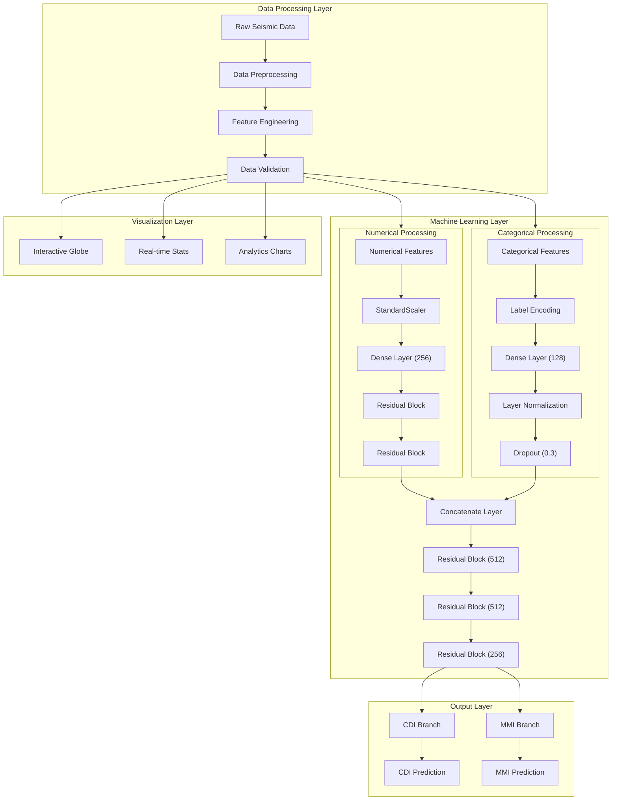

# Seismic Analysis and Prediction System

[](https://seismic-analysis-aiapp.streamlit.app/)

## 🏆 Impact-Metrics Competition Project
This project was developed for **Impact-Metrics**, a premier Data Analytics competition organized as part of **Jagriti** - the annual socio-awareness festival of IIT (BHU) Varanasi. The competition focuses on leveraging data analytics to address pressing social issues and create meaningful impact.

### 👥 Team Members
- [Mabhu Subhani](https://github.com/mabhusubhani001)
- [Vinay](https://github.com/vinay10110)

## 🎯 Project Overview
A comprehensive machine learning system for processing seismic data and predicting Community Decimal Intensity (CDI) and Modified Mercalli Intensity (MMI). The system combines advanced data processing with a dual-branch neural network architecture to provide accurate seismic predictions and real-time visualizations.

### 🌟 Key Features
- Real-time seismic data processing and analysis
- Dual prediction system for CDI and MMI metrics
- Interactive global visualization of seismic events
- Advanced neural network architecture with dual processing branches
- Real-time statistics and analytics dashboard
- User-friendly Streamlit interface


## 🛠️ Technical Architecture

### System Architecture Diagram


### Detailed Layer Description

#### Data Processing Layer
- Raw seismic data ingestion and validation
- Feature engineering and preprocessing
- Data quality checks and validation
- Real-time data processing capabilities

#### Machine Learning Layer
##### Numerical Branch
```
Input → StandardScaler → Dense(256) → ResidualBlock → ResidualBlock
```

Key Components:
- Standard scaling for numerical features
- Dense layer with 256 units
- Two residual blocks for deep feature extraction
- ReLU activation functions

##### Categorical Branch
```
Input → LabelEncoder → Dense(128) → LayerNorm → Dropout(0.3)
```

Key Components:
- Label encoding for categorical features
- Dense layer with 128 units
- Layer normalization for stable training
- Dropout (0.3) for regularization

##### Fusion and Processing
```
Concatenate → ResBlock(512) → ResBlock(512) → ResBlock(256)
```

Key Components:
- Concatenation of numerical and categorical features
- Three residual blocks with decreasing units (512 → 512 → 256)
- Skip connections for better gradient flow

#### Prediction Layer
Dual output branches:
- CDI (Community Decimal Intensity) prediction
- MMI (Modified Mercalli Intensity) prediction

Components:
- Dense layers for final predictions
- Custom loss functions for each metric
- Confidence score calculation

#### Visualization Layer
Interactive visualization components:
- Global seismic map with real-time updates
- Statistical dashboards and metrics
- Time series analysis plots
- Correlation visualizations

## 🚀 Live Demo
The application is deployed and accessible at: [https://seismic-analysis-aiapp.streamlit.app/](https://seismic-analysis-aiapp.streamlit.app/)

## 💻 Installation and Local Development

### Prerequisites
- Python 3.8+
- pip package manager
- Git

### Setup Instructions

1. Clone the repository
```bash
git clone https://github.com/yourusername/seismic-analysis.git
cd seismic-analysis
```

2. Create and activate virtual environment
```bash
python -m venv venv
source venv/bin/activate  # On Windows: venv\Scripts\activate
```

3. Install dependencies
```bash
pip install -r requirements.txt
```

4. Run the Streamlit app
```bash
streamlit run app.py
```

[Previous content remains the same until Data Sources and Processing section]

## 📊 Data Sources and Processing

### Dataset Overview

The project utilizes two primary datasets provided by the Impact-Metrics competition:

1. `earthquake_1995-2023.csv`
   - Historical earthquake data from 1995 to 2023
   - Contains temporal and geographical information
   - Includes magnitude and depth measurements

2. `earthquake_data.csv`
   - Complementary earthquake dataset
   - Additional seismic parameters and measurements
   - Community impact metrics

### Data Preprocessing

We performed comprehensive data cleaning and merging operations to create our final dataset: `preprocessed_earthquake.csv`

#### Preprocessing Steps:

1. **Data Cleaning**
   - Removed duplicate entries
   - Handled missing values
   - Standardized date/time formats
   - Normalized geographical coordinates

2. **Feature Engineering**
   - Created temporal features (year, month, day, hour)
   - Calculated distance metrics
   - Derived seismic intensity indicators
   - Generated geographical clusters

3. **Data Merging**
   - Combined both datasets using common identifiers
   - Resolved conflicting entries
   - Validated merged data integrity
   - Created consistent feature naming

4. **Quality Assurance**
   - Outlier detection and handling
   - Data type validation
   - Range checks for numerical values
   - Consistency verification

[Previous content remains the same until Dataset Structure section]

### Final Dataset Structure (`preprocessed_earthquake.csv`)

#### Core Features

| Feature | Description | Type |
|---------|------------|------|
| `title` | Description of the seismic event | String |
| `magnitude` | Strength of the earthquake | Float |
| `date_time` | Date and time of occurrence | Datetime |
| `cdi` | Community Decimal Intensity - measures the effects of an earthquake on humans and man-made structures | Float |
| `mmi` | Modified Mercalli Intensity - describes the severity of an earthquake based on its effects | Float |
| `alert` | Alert level issued for the earthquake | String |
| `tsunami` | Indicator if tsunami was generated (0/1) | Binary |
| `sig` | Significance of the event | Integer |
| `net` | Network that provided the data | String |
| `nst` | Number of seismic stations that reported the event | Integer |
| `dmin` | Minimum distance to station | Float |
| `gap` | Largest azimuthal gap between azimuthally adjacent stations | Float |
| `magType` | Method used to calculate the magnitude | String |
| `depth` | Depth of the earthquake in kilometers | Float |

#### Geographical Features
| Feature | Description | Type |
|---------|------------|------|
| `latitude` | Latitude of the epicenter | Float |
| `longitude` | Longitude of the epicenter | Float |
| `location` | Specific location description | String |
| `continent` | Continent where the earthquake occurred | String |
| `country` | Country where the earthquake occurred | String |

#### Temporal Features
| Feature | Description | Type |
|---------|------------|------|
| `year` | Year of occurrence | Integer |
| `month` | Month of occurrence | Integer |

### Data Usage Example

```python
import pandas as pd
import seaborn as sns
import matplotlib.pyplot as plt

# Load the dataset
df = pd.read_csv('preprocessed_earthquake.csv')

# Display basic information
print("Dataset Overview:")
print(df.info())

# Show basic statistics for numerical columns
print("\nNumerical Features Statistics:")
numerical_stats = df[['magnitude', 'depth', 'cdi', 'mmi', 'sig']].describe()
print(numerical_stats)

# Example: Correlation between magnitude and intensity measures
plt.figure(figsize=(10, 6))
sns.scatterplot(data=df, x='magnitude', y='cdi', alpha=0.5)
plt.title('Earthquake Magnitude vs CDI')
plt.xlabel('Magnitude')
plt.ylabel('Community Decimal Intensity (CDI)')
plt.show()

# Example: Distribution of earthquakes by continent
plt.figure(figsize=(12, 6))
df['continent'].value_counts().plot(kind='bar')
plt.title('Distribution of Earthquakes by Continent')
plt.xlabel('Continent')
plt.ylabel('Number of Earthquakes')
plt.xticks(rotation=45)
plt.show()
```

### Key Features for Analysis

1. **Intensity Metrics**
   - CDI (Community Decimal Intensity)
   - MMI (Modified Mercalli Intensity)
   - Magnitude
   - Significance

2. **Geographical Information**
   - Precise coordinates (latitude/longitude)
   - Hierarchical location data (country, continent)
   - Distance-related metrics (dmin, gap)

3. **Temporal Patterns**
   - Full timestamp information
   - Year and month for seasonal analysis
   - Historical trends analysis

4. **Safety Indicators**
   - Tsunami generation
   - Alert levels
   - Network reliability metrics (nst, gap)

### Data Quality Considerations

- Handle missing values in `cdi` and `mmi` fields appropriately
- Validate consistency between `magnitude` and intensity metrics
- Ensure geographical coordinates are within valid ranges
- Check temporal continuity and completeness
- Verify alert level categories
- Validate depth measurements


## 🎮 Using the Application

1. **Data Input**
   - Upload seismic data in CSV format
   - Input real-time seismic measurements
   - Select geographical region of interest

2. **Analysis Options**
   - Choose between CDI and MMI prediction
   - Select visualization type
   - Configure analysis parameters

3. **Visualization**
   - Interactive global map
   - Time series analysis
   - Correlation plots
   - Prediction confidence intervals

4. **Interpreting Results**
   - Understanding CDI/MMI predictions
   - Analyzing confidence scores
   - Interpreting visualization patterns

## 📈 Model Performance

### Metrics
- Mean Absolute Error (MAE)
- Root Mean Square Error (RMSE)
- R-squared Score
- Prediction Confidence Intervals

### Validation Results
- Cross-validation scores
- Test set performance
- Regional prediction accuracy

## 🤝 Contributing
We welcome contributions to improve the project! Please follow these steps:

1. Fork the repository
2. Create your feature branch (`git checkout -b feature/AmazingFeature`)
3. Commit your changes (`git commit -m 'Add some AmazingFeature'`)
4. Push to the branch (`git push origin feature/AmazingFeature`)
5. Open a Pull Request

## 🙏 Acknowledgments
- IIT (BHU) Varanasi for organizing Impact-Metrics
- Jagriti festival organizing committee
- All contributors and supporters

## 📞 Contact

For any queries regarding the project, please reach out to:
- [Mabhu Subhani](https://github.com/mabhusubhani001)
- [Vinay](https://github.com/vinay10110)

## 📚 Citation
If you use this project in your research or work, please cite:
```
@software{seismic_analysis_2024,
  title = {Seismic Analysis and Prediction System},
  author = {Mabhu Subhani and Vinay},
  year = {2024},
  publisher = {GitHub},
  url = {https://github.com/mabhusubhani001/seismic-analysis-ai}
}
```
